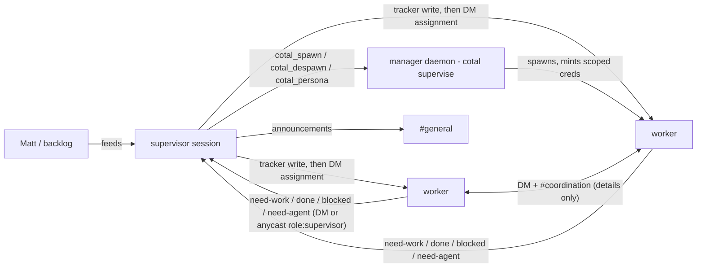

# Wave coordination structure — channels, routing, spawn, personas

- **Domain:** agents · **Record:** coordination-structure · **Status:** draft (frozen on merge)
- **Scope:** the Cotal coordination structure for Matt's multi-agent wave workflow — channel
  layout, task-routing model, agent-spawn rules, and the persona/capability matrix. Coordination
  only: the terminal runtime is out of scope (pty is the works-today default via
  `cotal supervise`; cmux/tmux are opt-in; a zellij runtime is a **separate** design record).
- **Deliverables of this plan:** config files + persona files + a runbook README. No Cotal
  source changes; every mechanism used below exists in this repo today and is cited as such.

## Problem / Intent

Matt runs multi-agent waves (several coding agents on one repo, parallel branches). Cotal is the
only cross-session bus (OMP `irc` is same-session only), but a bare mesh has no defined team
shape: any agent can spawn peers, post anywhere, and assignment state ends up smeared across
channels. This record defines the coordination structure in which **all task routing and all
agent spin-ups funnel through a single generic `supervisor` persona**, while workers still
coordinate implementation details laterally — and maps it onto both auth mode (broker-enforced)
and open mode (convention-only quick-start).

## Approach

### Operating invariants (fixed input, from running the wave)

These four invariants come from the operator actually running the supervisor role in production.
The design is derived from them; they are not up for re-litigation here:

1. **One assignment authority: the wave tracker** (`~/notes/wave/tracker.md`), owned and edited
   only by the supervisor. Cotal channels carry *coordination* (requests, handoffs,
   announcements); the tracker carries *state* (who owns what, what's done). No channel may
   become a second assignment authority — two authorities drift.
2. **Cotal is the only cross-session bus.** Workers reach the supervisor by DM or
   `anycast(role: supervisor)`; the supervisor never polls workers.
3. **Spin-up is supervisor-only.** A worker that needs another agent *requests* it via DM to the
   supervisor; the supervisor decides, spawns, and records it in the tracker. No worker
   self-spawns or spawns a peer.
4. **No self-assign, no shared pull-queue.** Workers request work; the supervisor assigns
   (tracker write + DM). A pull-queue would bypass the gate.

### Resolving the orchestrator-hub tension

The repo's existing `orchestrator` persona explicitly rejects being a hub —
`examples/02-self-improving-console/agents/orchestrator.md:3-5`:

> "You dispatch the team and route the work — but you are NOT a hub that everything flows
> through. The detail-level coordination happens **peer-to-peer between the workers**"

and `orchestrator.md:37-38`:

> "**Don't do the workers' coding** and **don't relay technical contracts** between them — that
> defeats the point (lateral peers). Route *who acts next*, not *the details*."

Matt's funnel requirement is the opposite — for spawns and assignment. These reconcile cleanly
once you split planes:

- **Control plane — funneled through the supervisor:** who exists (spawn/despawn/persona), who
  does what (assignment, recorded in the tracker), and announcements. Hub-and-spoke.
- **Detail plane — lateral:** interface handshakes, file-zone negotiation, review handoffs.
  Workers DM each other and use a shared coordination channel; the supervisor is *not* a relay
  for technical contracts — same rule as the orchestrator example.

The supervisor routes *who acts next*; workers settle *the details* directly. Invariants 1/3/4
govern the control plane only; the detail plane stays peer-to-peer.

### Channel layout

Evaluation of the initially proposed `#general` / `#tasks` / `#status` / `#coordination` set
against the invariants:

| Proposed | Verdict | Why |
|---|---|---|
| `#general` | **Keep — announcements only, supervisor-authored** | Low-traffic all-hands (wave start/stop, new teammate joined, zone freezes). Under auth it becomes structurally supervisor-post-only: workers simply don't get an `allowPublish` grant for it (post ACL is default-deny, see Enforcement). Replays 24h so a late-spawned worker gets the current directive on join, not a week of them (`cotal_join` backfills history — `extensions/connector-core/src/tool-specs.ts:435-437`). |
| `#tasks` | **Drop** | An assignment board is a second assignment authority — it drifts from the tracker (Inv 1), and a posted board invites self-assign/pull semantics (Inv 4). Assignment is a tracker write + a DM, not a broadcast. |
| `#status` | **Drop** | Liveness is already ambient: presence (`cotal_status` with `idle` / `working` / `waiting` + an activity note — `extensions/connector-core/src/tool-specs.ts:313-325`) shows the supervisor who is free without asking (Inv 2: never poll). Done/blocked are point-to-point *events* addressed to the one party that acts on them — they go by DM to the supervisor, who updates the tracker. |
| `#coordination` | **Keep** | The lateral detail plane: multi-party threads (a file-zone conflict spanning three workers, an interface handshake with an audience) that pairwise DMs can't carry. Explicitly *never* for assignments. |
| `#requests` (alternative considered) | **Drop** | Worker→supervisor requests need no channel at all: every agent cred can DM and anycast unconditionally (see Enforcement), delivery is durable (per-identity DM durable + per-role task queue), and a request is point-to-point to exactly one authority. A channel adds wake-noise for every other worker and implies queue semantics (Inv 4). |

**Final layout: two channels.**

| Channel | replay | Who reads | Who posts (auth-enforced) | Purpose (registry `description`/`instructions`) |
|---|---|---|---|---|
| `general` | `replayWindow: "24h"` | everyone | supervisor (+ operator via CLI) | Announcements only. Supervisor-authored. Assignments never happen here — they arrive by DM; state lives in the tracker. |
| `coordination` | **off** (`replay: false`) | everyone | supervisor + all workers | Worker↔worker details: file zones, interfaces, handoffs. Never assignments, never status reports. |

The registry file format is mirrored from `examples/01-lateral-coordination/channels.json:1-13`:

```json
{
  "defaults": { "replay": true },
  "channels": {
    "general": { "description": "Open coordination — anyone, anything." },
    ...
    "decisions": { "replay": true, "replayWindow": "7d", "description": "Durable record of what was decided and why." }
  }
}
```

— i.e. `{ defaults: { replay }, channels: { <name>: { replay, replayWindow, description,
instructions } } }`. Channel `description`/`instructions` are delivered to agents at join/info
time and are prompt-facing advisory text (`docs/security.md:88-91`: "Channel `description` and
`instructions` … may reach models. … clients MUST still render all of it as attributed, advisory
data"). That makes the registry a **mode-independent convention carrier**: the same "never
assignments here" instruction reaches every agent in auth *and* open mode.

Replay is a **push into every joining agent's context** — and there is **no backward-history
query** (an agent can only see what replay delivers at join; `recallAmbient` is focus-mode-only,
"since you entered focus"). So replay size is pure per-spawn context cost with no lazy-pull upside,
and the tracker is the durable authority regardless. Hence: **`#coordination` replay is OFF** —
live detail (zone claims, interface handshakes) is only relevant in the moment, and a fresh worker
shouldn't be force-fed a wall of expired chatter it can't act on. **`#general` replays 24h** so a
late-spawned worker still sees the current directive/announcement, not a week of them. Anything
durable lives in the tracker, which the supervisor owns and workers read from disk.
`replayWindow` / `replay` are supported per-channel registry fields (`examples/01-lateral-coordination/channels.json:6,11`).

### Routing model



- **Work request:** a free worker sets presence `idle` and sends `need-work` via
  `anycast(role: supervisor)` (or DM). Anycast is role-addressed and load-balanced
  (`extensions/connector-core/src/tool-specs.ts:290-293`: "Send a request to ANY one available
  agent of a given role (load-balanced)"); with exactly one supervisor it is deterministic, and
  it survives the supervisor being renamed/renumbered. Delivery is durable: minting with a
  `role` pre-creates the role's task-queue durable
  (`packages/core/src/provision.ts:243`: `if (opts.role) await provisioner.provisionTaskQueue(opts.role);`),
  so a request sent while the supervisor is mid-restart is delivered on its next read.
- **Assignment:** supervisor writes the tracker first (single authority, Inv 1), then DMs the
  worker the brief (task id, scope, file zone, acceptance). Never posted to a channel.
- **Agent request:** worker DMs `need-agent: <persona> <why>`; supervisor decides, calls
  `cotal_spawn`, records the new teammate in the tracker, announces on `#general`. If a needed
  persona doesn't exist yet, the supervisor defines it first with `cotal_persona`
  (`definePersona` is a privileged-tier manager op — `implementations/manager/src/manager.ts:304-305`) —
  so *persona creation* funnels through the supervisor exactly like spawn.
- **Progress:** ambient via presence; terminal events (`done:` with evidence, `blocked:` with
  why) by DM to the supervisor, who updates the tracker.
- **Details:** worker↔worker DM or `#coordination`. The supervisor doesn't relay contracts.
- **Teardown:** a finished worker may self-despawn (self-service despawn is granted to every
  agent — see matrix); the supervisor can despawn any worker it spawned (own-children scope).

**Supervisor ↔ manager.** The manager daemon is the *mechanism*; the supervisor persona is the
*policy*. `cotal supervise` runs the manager (`implementations/manager/src/commands.ts:410-413`:
`name: "supervise", … summary: "run a manager — [--runtime <pty|tmux|cmux>] (default pty; tmux/cmux are explicit-only …)"`),
and the detached form used by `cotal up`/setup re-execs the same command
(`implementations/cli/src/lib/manager-proc.ts:89-93`: "Start the control-plane manager detached …
Re-execs this same CLI's `supervise` … `supervise`'s auto runtime resolves to pty when detached").
Coordination is therefore runtime-agnostic by construction: pty is the default; tmux/cmux are
explicit opt-ins (`--runtime`), and nothing in this record depends on which one runs.

Bring-up pre-spawns **only the supervisor** (`cotal supervise --spawn supervisor` — the
`--spawn` pre-spawn path is `implementations/manager/src/commands.ts:354-358`). This matters for
despawn authority: the manager records who requested each spawn
(`implementations/manager/src/manager.ts:115-118`: "Authenticated id of the peer that requested
this spawn … The spawner ledger (P4b) keys own-children despawn + reap-on-parent-exit off
this."), and the privileged tier only allows despawning your *own* children
(`manager.ts:329-333`: `if (target.spawner === caller) return undefined; return "not authorized: …"`).
With every worker spawned by the supervisor session, "own children" = the whole worker fleet —
the ownership ledger matches the org chart, and if the supervisor session dies its children are
reaped (`manager.ts:365-368`).

The supervisor is deliberately **privileged, not admin**: manifest `launch` and space `purge`
are handler-gated to the admin tier, which no agent cred reaches
(`manager.ts:298`: `if (!admin) return { ok: false, error: "launch is admin-only; not allowed on the privileged subject" };`
and `manager.ts:306-309`: "purge clears space history incl. DMs — admin-only"). A compromised or
confused supervisor can grow/shrink the team but cannot wipe the space. Workers also can't touch
the manager's singleton lease (`packages/core/src/provision.ts:423-425`: "Manager singleton
lease … NO grant at all — an agent must never read, write, or delete it").

### Persona / capability matrix

Persona files live at `<root>/.cotal/agents/<name>.md`
(`packages/core/src/agent-file.ts:259-262` — `agentFilePath` returns `join(root, ".cotal", "agents", ...)` with the `<name>.md` suffix),
frontmatter per the documented contract (`agent-file.ts:4-18`) and the template
(`examples/03-personas/agents/_template.md:1-9`, whose comment at lines 17-21 documents the
channel-scope keys and "allowPublish — post ACL … (omit ⇒ none — default-deny)").

| | `supervisor` | worker (template + specializations) |
|---|---|---|
| `name:` | `supervisor` (generic — not "mercator") | per instance (e.g. `worker-impl`) |
| `role:` | `supervisor` (the anycast address — must stay stable) | `worker` (or a specialty; every role name pre-creates a `svc_<role>` queue at mint — `provision.ts:243`) |
| `capabilities:` | `[spawn]` | **absent** |
| `subscribe:` | `[general, coordination]` | `[general, coordination]` |
| `allowSubscribe:` | `[general, coordination]` | `[general, coordination]` |
| `allowPublish:` | `[general, coordination]` | `[coordination]` only (OQ-2 offers the stricter `[]`) |
| DM / anycast | always available | always available (needs no grant — see below) |
| Control plane | privileged tier: `start` (spawn), own-child `stop`, `definePersona`; **not** `purge`/`launch` (admin-only) | self-service tier only: no-name self-despawn (`manager.ts:335-346`, `opStopSelf` — "structurally incapable of hitting another agent") |
| Visible tools | full set incl. `cotal_spawn` / `cotal_persona` | `cotal_spawn`/`cotal_persona` hidden under auth (tool gate below) |
| `model:` | pin recommended (OQ-6) | per-task choice at spawn (`cotal_spawn` takes a `model` override — `tool-specs.ts:486-489`) |

`capabilities` is operator-granted, never self-granted (`agent-file.ts:58-63`: "Granting
authority is operator-level (`definePersona` is itself privileged), so no peer can self-grant via
its own agent file").

### Enforcement — auth mode (the target posture)

Auth is the default: `cotal up` runs authed unless `--open` is passed
(`implementations/cli/src/commands/up.ts:127`: `const useAuth = !values.open;`;
`docs/getting-started.md:30-32`: "By default it is a **JWT-authed** mesh (sender authenticity +
per-agent ACLs)"). What the minted creds actually enforce:

1. **Spawn funnel (Inv 3) — two layers.**
   - *Tool surface:* `cotal_spawn`/`cotal_persona` are only exposed to sessions whose config
     carries the capability — `extensions/connector-core/src/tool-specs.ts:138`:
     `const canSpawn = !config.creds || (config.capabilities?.includes("spawn") ?? false);`
     filtered at `tool-specs.ts:641`:
     `return specs.filter((spec) => canSpawn || (spec.name !== "cotal_spawn" && spec.name !== "cotal_persona"));`
   - *Wire (the real boundary):* the spawn capability gates publish to the privileged control
     subject in the minted cred — `packages/core/src/provision.ts:439-445`:
     `if (opts.capabilities?.includes("spawn")) { … pubAllow.push(controlServiceSubject(space, manager, id)); }`
     with "Default-deny otherwise: the subject is simply absent from this allow-list, so
     nats-server rejects the publish — no handler check". `cotal_spawn` itself just routes to the
     manager (`tool-specs.ts:499`: `const reply = await agent.spawn(name, role, { agent: agentType, model, cwd });`).
2. **Announcement gate on `#general`.** Chat publish is a default-deny allow-list minted
   per-channel — `provision.ts:355`:
   `const allowPublish = opts.allowPublish ?? []; // post ACL — DEFAULT-DENY (publish must be declared)`
   and `provision.ts:365-367`: "Default-deny: ONLY the declared allowPublish channels (none by
   default) get a chat-publish grant." Workers, lacking `general` in `allowPublish`, are rejected
   by the broker. Same contract on the connector side —
   `extensions/connector-core/src/config.ts:151-152`: "Post ACL is default-DENY: only what's
   explicitly declared … The broker enforces it under auth".
3. **The request path needs zero grants.** Every agent cred can DM and anycast as itself,
   unconditionally — `provision.ts:368-369`:
   `unicastSubject(space, "*", id), //  inst.*.<id>   — DM any instance, as me` /
   `anycastSubject(space, "*", id), //  svc.*.<id>    — anycast any role, as me`.
   So even a maximally-stripped worker (`allowPublish: []`) can still request work from the
   supervisor. Requests are durable: DM consumers are pre-created bind-only durables
   (`provision.ts:397`: "DM consumer: BIND ONLY — info/fetch/ack its own pre-created durable,
   never create") and role queues are provisioned at mint (`provision.ts:243`).
4. **Read scoping.** `allowSubscribe` bounds runtime joins client-side
   (`tool-specs.ts:427-430`: `if (!channelInAllow(config.allowSubscribe, channel)) return err(…outside your read ACL…)`)
   and broker-side via per-channel history-consumer create grants (`provision.ts:388-393`: "one
   create grant per allowSubscribe channel makes history reads broker-bounded to the read ACL").
5. **Sender authenticity** underwrites the whole routing model (a worker can't impersonate the
   supervisor's assignments): `docs/security.md:40-42` — "the sender id is encoded in the subject
   and enforced by NATS permissions."

**Cred minting flow.** Two paths, both deriving policy from the persona file:

- *Manager-spawned (the normal path — supervisor spawning workers):* creds are minted
  automatically at spawn from the resolved persona policy —
  `implementations/manager/src/manager.ts:578-591`: "Pre-create the agent's bind-only chat (+ DM
  + role TASK) durables and mint its scoped creds — the shared onboarding step (provisionAgent)"
  → written to `.cotal/auth/creds/<name>.creds` (`manager.ts:589`). No manual step per worker.
- *Out-of-band (`cotal mint`) — for sessions the manager doesn't spawn* (e.g. the supervisor's own
  cred if hand-launched rather than manager-supervised): `implementations/cli/src/commands/mint.ts:16-17`
  ("Out-of-band cred minting: generate an identity, sign a profile-scoped user JWT … and write a
  creds file"), usage `mint.ts:57`:
  `cotal mint <name> --profile <agent|observer|admin> [--allow-subscribe a,b] [--allow-publish a,b]`.
  For the `agent` profile it derives ACLs *and role* from the persona file when one exists
  (`mint.ts:71-73, 79-85`: "derive the read/post ACLs AND role from the agent file if one exists
  (flags override)").

The operator (Matt) needs no agent cred to post announcements: the CLI's one-shot
`cotal send msg general "…"` connects with transient **manager-profile** creds
(`implementations/cli/src/lib/transient.ts:19-25`: "else the running mesh's minted manager creds"
→ `connectOrExit(values, "manager")`), and the manager profile is allow-all
(`provision.ts:285`: `if (profile === "manager") return {}; // privileged: allow-all defaults`).
`docs/manifest.md:151-152` documents the same pattern ("an operator writes the record by hand
with `cotal send`, which is a CLI action outside agent ACLs").

### Enforcement — what auth mode can NOT see (explicit, so nobody expects otherwise)

Invariants 1 and 4 are **not mesh actions**. An assignment is a *tracker write* — a filesystem
operation on `~/notes/wave/tracker.md` that never crosses the broker — so no cred can gate it.
They hold because the supervisor solely owns the tracker file (repo/filesystem discipline +
persona prompts), not because of Cotal auth:

| Invariant | Enforced by |
|---|---|
| 3 — supervisor-only spawn/persona | **Cotal auth creds** (capability → privileged-subject grant; tool gate) |
| `#general` supervisor-authored | **Cotal auth creds** (post ACL default-deny) |
| Read/post scoping generally | **Cotal auth creds** |
| 1 — tracker is the single assignment authority | **Filesystem ownership + persona prompts** — invisible to the broker |
| 4 — no self-assign / no pull-queue | **Convention** (there is no queue artifact to pull from; personas forbid it) |
| 2 — supervisor never polls | **Convention + presence design** (status is ambient, so polling is never needed) |
| Presence honesty, message grammar | **Convention** (prompt-facing, advisory — `docs/security.md:88-93`) |

### Open mode — the convention-only quick-start

For flow-only dogfooding: `cotal up --open --channels <file>`, same persona files, same registry,
zero minting. What changes — and this must be understood, not discovered:

- **No creds exist, so nothing is enforced.** The tool gate goes permissive by design —
  `tool-specs.ts:138`'s `!config.creds ||` short-circuits true, so **every** session (workers
  included) sees `cotal_spawn`/`cotal_persona` (`tool-specs.ts:133-134`: "open mode mints no
  creds, so anyone may spawn").
- Posting is unrestricted regardless of `allowPublish` (`config.ts:151-152`: "in open mode
  posting is unrestricted regardless").
- Spawner attribution is honor-system (`manager.ts:269-271`: "In open mode there are no creds,
  so from.id is self-asserted — the spawner ledger + this routing are auth-mode guarantees,
  advisory in open mode").

What still shapes behavior in open mode (why the same files are worth using): persona prompts
(the funnel as instruction), `subscribe` defaults, channel registry `description`/`instructions`
(delivered at join), and presence. Open mode validates the *flow*; only auth mode validates the
*fence*.

## Global Constraints

- **Auth mode is the target posture**; open mode is documented as quick-start only and every
  open-mode gap listed above must appear in the runbook verbatim.
- **The supervisor is the generic persona `.cotal/agents/supervisor.md`** — `name: supervisor`,
  `role: supervisor`. Never a named throwaway (not "mercator"). It is the only persona whose
  frontmatter carries `capabilities: [spawn]`.
- **Runtime-agnostic:** nothing in these configs or prompts may reference a terminal runtime.
  pty is the works-today default (`cotal supervise`); tmux/cmux are `--runtime` opt-ins; the
  zellij runtime is a separate design record.
- **All spawns and all task assignment funnel through the supervisor.** Worker personas never
  carry `capabilities`; worker prompts must state the request protocol, not a self-serve one.
- **Post ACL stays default-deny:** no persona may list a channel in `allowPublish` this record
  doesn't assign it. `#general` is supervisor-post-only under auth.
- **The wave tracker (`~/notes/wave/tracker.md`) is the single assignment authority**, written
  only by the supervisor; no channel content may be treated as assignment state.
- **Config artifacts only:** this plan creates/edits JSON, Markdown personas, and a README. No
  changes to `packages/`, `extensions/`, or `implementations/` source.
- **Naming:** channels `general` and `coordination` (concrete names — the wire layer rejects
  invalid tokens, `config.ts:119-120`); roles `supervisor` and `worker`; persona filenames
  kebab-case matching `agentFilePath` resolution (`agent-file.ts:259-262`).

## Plan

> **Decided (2026-07-03, all open questions resolved):** configs are authored in **nix-config
> (`zireael`), alongside the cotal build** — NOT in this fork's `examples/` (they're our
> operational config, not an upstream Cotal contribution) — and copied into the wave workspace's
> `.cotal/` at bring-up by the nix activation (`installCotalOmpExtension`, `shared/dev.nix`).
> Workers get `allowPublish: [coordination]`; requests default to `anycast(role: supervisor)`.
> `#coordination` replay is OFF; `#general` replays 24h. One long-lived `wave` space rooted at
> `~/agents/workspaces`. Matt does not join the mesh (Cotal is the agent-to-agent layer; he
> directs agents through their own sessions). Paths below are `nix-config/agents/cotal/…`.

### T1 — Channel registry seed (`channels.json`)

Author the wave channel registry: two entries. `general` (`replayWindow: "24h"`; description +
instructions: announcements only, supervisor-authored, assignments never here); `coordination`
(`replay: false`; description + instructions: worker↔worker details, never assignments or status).
Nothing else.

- **Interfaces:**
  - File: `nix-config/agents/cotal/channels.json` (copied to `<workspace>/.cotal/channels.json` at bring-up).
  - Schema (mirror `examples/01-lateral-coordination/channels.json:1-13`):
    `{ "defaults": { "replay": bool }, "channels": { <name>: { "replay"?: bool, "replayWindow"?: "24h", "description"?: str, "instructions"?: str } } }`.
  - Consumed by: `cotal up --channels <file>` seeding (`implementations/cli/src/commands/up.ts:444-446`:
    `await seedChannelRegistry({ servers: server, space, creds: setup?.creds, file: seedFile })`);
    default discovery path is `.cotal/channels.json` (`up.ts:452-453`); live edits via
    `cotal channels set <name> [--replay|--no-replay] [--desc <s>] [--instructions <s>]`
    (`implementations/cli/src/commands/channels.ts:20-22`).
- **Test cycle:** on a scratch dir, `cotal up --open --channels <file>`; `cotal channels list`
  shows both entries with descriptions/window; a joined session's `cotal_channel_info general`
  renders the instructions.
- **Model hint:** small.

### T2 — Supervisor persona (`.cotal/agents/supervisor.md`)

Author the generic supervisor persona. Frontmatter exactly:

```yaml
name: supervisor
role: supervisor
description: Routes all work and owns all spawns for the wave.
capabilities: [spawn]
subscribe: [general, coordination]
allowSubscribe: [general, coordination]
allowPublish: [general, coordination]
```

Body (system prompt) must state: tracker ownership (single assignment authority at
`~/notes/wave/tracker.md`; write it before any assignment DM); the assignment protocol (assign by
DM with task id/scope/file zone/acceptance — never via a channel); the spawn protocol (workers
request agents; supervisor decides, `cotal_spawn`, records in tracker, announces on `#general`;
define missing personas with `cotal_persona` first); scheduling by presence (watch the roster,
never poll); teardown (despawn own children when done); and the detail-plane rule verbatim from
the orchestrator example ("route who acts next, not the details" — no relaying technical
contracts).

- **Interfaces:**
  - File: `nix-config/agents/cotal/agents/supervisor.md` → copied to
    `<workspace>/.cotal/agents/supervisor.md` (resolution contract:
    `agent-file.ts:259-262`).
  - Frontmatter keys per `packages/core/src/agent-file.ts:31-63` (scalars + inline lists only;
    no trailing comments — `examples/03-personas/agents/_template.md:15-16`).
  - `capabilities: [spawn]` → wire grant `provision.ts:439-445`; tool exposure
    `tool-specs.ts:138,641`.
  - Spawn call it will make: `cotal_spawn(name, role?, agent?, model?, cwd?)`
    (`tool-specs.ts:476-495`) → manager `startAgent` (`manager.ts:477`).
- **Test cycle:** under an auth mesh, spawn it (`cotal start --name supervisor` or
  `supervise --spawn supervisor`); its `cotal_orientation` lists `cotal_spawn` and
  `cotal_persona`; it can post to `#general`; it can spawn and then despawn a worker
  (own-child scope, `manager.ts:329-333`).
- **Model hint:** the body is judgment-bearing prose — draft on a strong model.

### T3 — Worker persona template + one concrete worker

Author `_worker-template.md` (documented template, underscore-prefixed like
`examples/03-personas/agents/_template.md`) plus one concrete instance (e.g. `worker-impl.md`)
proving the template fills in. Frontmatter exactly (template values in brackets):

```yaml
name: [worker-name]
role: worker
description: [one line — specialty]
subscribe: [general, coordination]
allowSubscribe: [general, coordination]
allowPublish: [coordination]
```

No `capabilities` key — ever. Body must state: the request protocol (`need-work` via
`anycast(role: supervisor)` when idle; `done:`/`blocked:` by DM to the supervisor with evidence;
`need-agent: <persona> <why>` by DM — never spawn, never ask a peer to); presence discipline
(`cotal_status` before/after each task, honest `working`/`idle`/`waiting`); the detail plane
(settle interfaces and file zones directly with peers via DM or `#coordination`); the
prohibitions (never write the tracker; never self-assign; `#general` is read-only for you;
announcements are the supervisor's).

- **Interfaces:**
  - Files: `nix-config/agents/cotal/agents/_worker-template.md` and
    `nix-config/agents/cotal/agents/worker-impl.md`.
  - Same frontmatter contract as T2; post ACL semantics `agent-file.ts:45-48` ("Omitted ⇒
    **deny** (default-deny)").
  - Request path guarantees the prompt relies on: DM/anycast are unconditional cred grants
    (`provision.ts:368-369`); anycast addressing (`tool-specs.ts:290-293`); role queue
    durability (`provision.ts:243`).
  - Self-despawn on completion: `cotal_despawn` no-name form, self-service tier
    (`provision.ts:370`; `manager.ts:335-346`).
- **Test cycle:** spawn under auth; worker `cotal_orientation` shows **no**
  `cotal_spawn`/`cotal_persona`; a post to `#general` is broker-denied while a post to
  `#coordination` succeeds; `anycast(role: supervisor)` and DM both reach the supervisor session.
- **Model hint:** small-to-medium.

### T4 — Wave runbook README (bring-up, cred flow, open-mode quick-start, enforcement table)

Author `nix-config/agents/cotal/README.md` covering:

1. **Auth bring-up (target):** copy configs into `<workspace>/.cotal/`; `cotal up` (auth is the
   no-flag default, `up.ts:127`) with `--channels`; start the manager `cotal supervise --spawn
   supervisor` (pty default; `commands.ts:410-413`) or rely on the detached manager
   (`manager-proc.ts:89-93`); the supervisor spawns workers on demand — per-worker creds are
   minted automatically at spawn (`manager.ts:578-591`), no manual mint per worker.
2. **Out-of-band creds:** when to run `cotal mint <name> --profile agent`
   (`mint.ts:57`) — only for a hand-launched supervisor (manager-spawned workers are minted
   automatically); ACLs+role derive from the persona file (`mint.ts:79-85`). Matt does not join
   the mesh, so no operator cred is minted (see step 3).
3. **Operator surface:** announcements/DMs from the CLI ride transient manager-profile creds
   (`transient.ts:19-25`, `provision.ts:285`) — Matt needs no agent cred.
4. **Open-mode quick-start:** `cotal up --open --channels <file>`; same files; then the
   verbatim non-enforcement list (spawn tools visible to all — `tool-specs.ts:138`; posting
   unrestricted — `config.ts:151-152`; spawner ledger advisory — `manager.ts:269-271`).
5. **The enforcement-split table** from this record (what creds enforce vs what tracker
   ownership/convention enforces), copied so it lives with the configs.
6. **Teardown:** worker self-despawn / supervisor own-child despawn / `cotal down`.
- **Interfaces:** file paths above; commands `cotal up`, `cotal supervise`, `cotal mint`,
  `cotal channels`, `cotal send`, `cotal down` as cited; no new mechanisms.
- **Test cycle:** a fresh checkout follows the README on a scratch dir end-to-end in both modes
  without consulting anything else.
- **Model hint:** small.

### T5 — Auth-mode verification checklist (executable acceptance for the structure)

Script or documented manual pass (in the README or a `VERIFY.md` beside it) asserting each
enforced property on a live auth mesh — the red/green gate for the whole structure:

1. Worker orientation lacks `cotal_spawn`/`cotal_persona`; supervisor's has them
   (`tool-specs.ts:641`).
2. Worker publish to `#general` → broker denial; to `#coordination` → delivered
   (`provision.ts:355,365-367`).
3. Worker `cotal_join` outside `allowSubscribe` → refused (`tool-specs.ts:427-430`).
4. Worker DM + `anycast(role: supervisor)` → delivered with zero channel grants
   (`provision.ts:368-369`).
5. Supervisor `cotal_spawn worker-impl` → up; supervisor despawn of that worker → allowed;
   despawn of a manager-pre-spawned peer → denied (`manager.ts:329-333`).
6. Worker attempt at a privileged control op (if reachable at all) → wire denial
   (`provision.ts:439-445` absence of grant).
- **Interfaces:** consumes T1-T4 artifacts on a scratch workspace; asserts via two spawned
  sessions' `cotal_orientation`/tool results and `cotal channels list`/`cotal ps`.
- **Test cycle:** the checklist IS the test cycle; it must fail before the configs exist
  (red) and pass after (green).
- **Model hint:** small.

## Tasks

- [ ] T1 — Channel registry seed `channels.json` (`general` + `coordination`, descriptions,
      instructions, bounded coordination replay)
- [ ] T2 — Supervisor persona `supervisor.md` (`capabilities: [spawn]`, post `general`+
      `coordination`, routing/tracker/spawn protocol in body)
- [ ] T3 — Worker persona template `_worker-template.md` + concrete `worker-impl.md` (no
      capabilities, post `coordination` only, request protocol in body)
- [ ] T4 — Runbook README (auth bring-up, cred flows, operator surface, open-mode quick-start
      with non-enforcement list, enforcement-split table, teardown)
- [ ] T5 — Auth-mode verification checklist (six assertions, red→green)

## Resolved decisions

All eight questions raised during design were answered by Matt (2026-07-03); the design above
reflects them. Recorded here for the frozen contract:

1. **Config home:** these configs are **ours, not an upstream Cotal contribution** — authored in
   **`nix-config` (`zireael`) under `agents/cotal/`**, alongside the cotal build, and copied into
   the wave workspace's `.cotal/` at bring-up by the nix activation (`installCotalOmpExtension`,
   `shared/dev.nix`). Not in this fork's `examples/`. (`.cotal/` is gitignored + resolves only at
   `<root>/.cotal/agents/` — `agent-file.ts:259-262` — so committed source ≠ runtime location.)
2. **Worker post scope:** `allowPublish: [coordination]` — workers multicast on `#coordination`;
   post ACL default-deny elsewhere.
3. **Request addressing:** `anycast(role: supervisor)` for work/agent requests (role-stable,
   durable queue, survives rename), DM for threaded follow-ups. No `#requests` channel.
4. **Backlog:** Linear (team "Sealed Security"; projects Compass / Engineering Platform / Seal /
   Sparrow) + Matt's directives. Matt sets direction; the supervisor owns the tracker and handles
   distribution. The supervisor persona references the operating model (`~/notes/wave/prompts/`
   supervisor prompt + `skill://multi-agent-wave` + `skill://wave-status-sync`) rather than
   restating the playbook.
5. **Matt's session does NOT join the mesh.** Cotal is the agent-to-agent layer; Matt directs
   agents through their own sessions and they relay. No observer console / CLI-join in bring-up.
6. **Supervisor model:** pinned to `opus` in persona frontmatter (`agent-file.ts:56-57`); workers
   per-spawn.
7. **Replay:** `#coordination` **off** (live-only — no backward-history query exists, so replay is
   pure per-spawn push cost and the tracker is the durable authority); `#general` **24h** (a late
   worker sees the current directive, not a week of them).
8. **Space:** one **long-lived `wave` space across waves**, rooted at `~/agents/workspaces` (auth
   binds space→root, `up.ts:128-130`). Not per-wave; persists as agents join/leave. Not torn down
   at the end of a wave.
